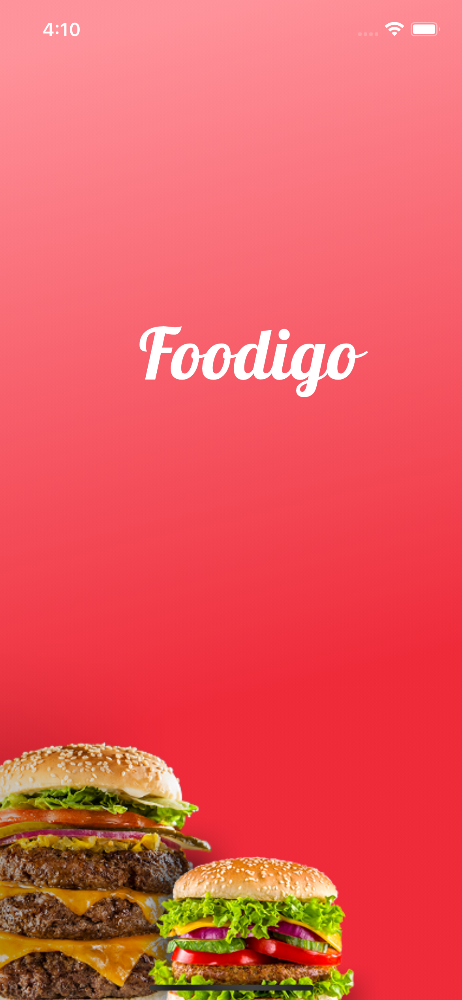
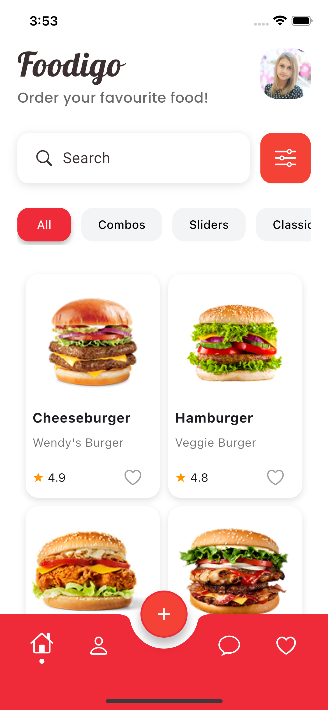
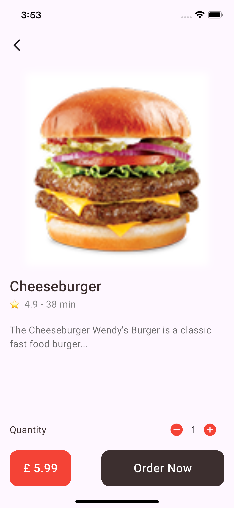
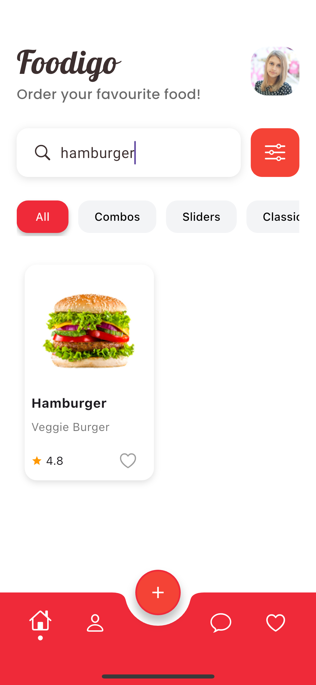
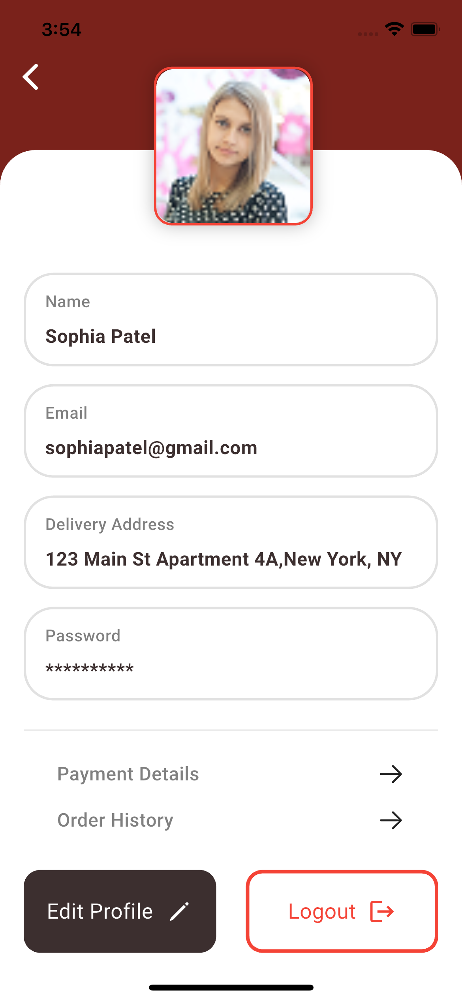
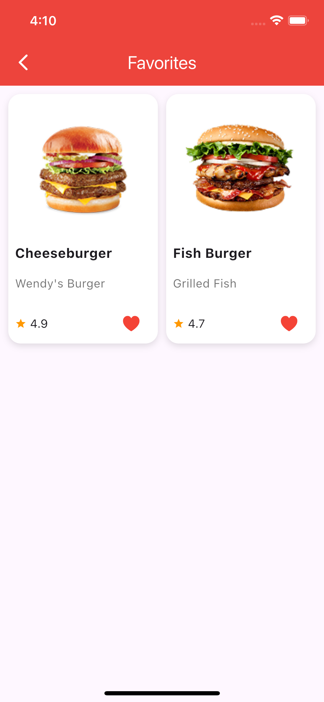

# 🍔 Foodigo - Flutter Food Delivery UI App

Foodigo is a **Flutter-based UI project** inspired by this [Figma Design](https://www.figma.com/design/bEUJBVy3bJ5dbP1LKSfp6h/Food-App-Design-UI-Template--Community-?node-id=0-1&p=f&t=lOXcUDUaEGKuXGK8-0). The app demonstrates a complete front-end structure for a food ordering application with beautiful visuals and useful interactions.

---

## ✨ Features Implemented

- 🔎 **Search bar**: Users can search live through the available food items by title.
- ❤️ **Favorite items**: You can mark food items as favorites — they instantly show up in the dedicated **Favorites tab**.
- 🧮 **Quantity control**: Quantity increase/decrease functionality works on the product detail page.
- 🏠 **Clean home layout**: Visually consistent layout with cards, categories, and product listings.
- 📱 **Responsive UI**: Built with Flutter’s `LayoutBuilder` and media queries for adaptive design.
- 📷 **Images**: Includes stock images (some may appear hazy due to compression or scaling).

---

## 🧪 What’s Functional

- Home page and product cards UI
- Navigating to and from product detail pages
- Favorite toggle and favorite tab
- Search filtering (works smoothly)
- Navigation bar with icon feedback and active state indicators

---

## 🚧 Work In Progress

- 🔄 **Sort By option** on the home page — UI is present but functionality is not implemented yet.
- 💬 **Chat with support** — Tapping the icon leads to a placeholder page.
- 🚪 **Log out behavior** — Navigates back to the app's first screen intentionally (designed behavior).
- 🧑 **Edit Profile** — Not implemented yet; profile details are static.
- 🛒 **Ordering a food** — Leads back to the homepage; full order flow is a future goal.
- 🏷️ **Product category chips** — Displayed but currently not functional.

---

## 📦 Scalability

- Product list is **modular and easily extendable**.
- All items use structured `Map<String, dynamic>` objects so you can plug in real data later.
- Designed for expansion into a real e-commerce backend (Firebase, Supabase, etc.)

---

## 🛠️ Tech Stack

- **Framework**: Flutter (Dart)
- **Packages**: `google_fonts`, `cupertino_icons`
- **IDE**: Android Studio
- **Design Source**: [Figma Food App UI Template](https://www.figma.com/design/bEUJBVy3bJ5dbP1LKSfp6h/Food-App-Design-UI-Template--Community-?node-id=0-1&p=f&t=lOXcUDUaEGKuXGK8-0)

---

## 📸 Screenshots

<p float="left">
  
  
  
  
  
  
</p>

---

## 🚀 Getting Started

1. Clone this repository:
   ```bash
   git clone https://github.com/your-username/foodigo.git
   cd foodigo
